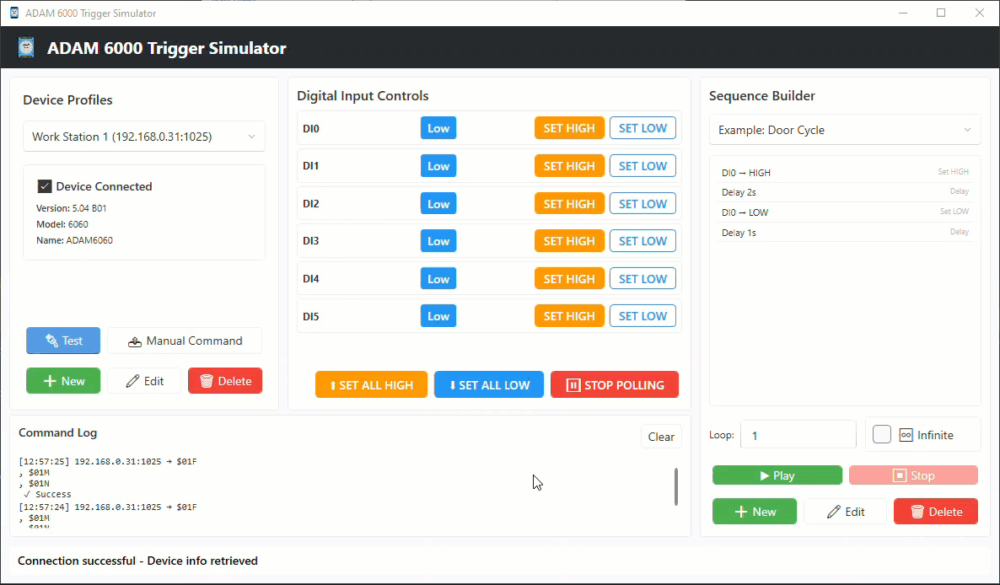

[](https://opensource.org/licenses/MIT)
[](https://github.com/dmchristensen/AdamTriggerSimulator/releases)
[](https://dotnet.microsoft.com/)
[](https://docs.microsoft.com/en-us/dotnet/desktop/wpf/)

# ADAM 6000 Trigger Simulator

A Windows desktop application for simulating digital input triggers on Advantech ADAM 6000 I/O modules. Perfect for testing and troubleshooting industrial automation scenarios when you don't have access to the physical hardware such as sensors, photo eyes, interlocks, or any other sort of triggering device that would be connected to an ADAM I/O module.

## Features

### Device Profile Management
- Create, edit, and save multiple device configurations
- Quick-switch between different ADAM 6060 units
- Store IP address, port, and custom descriptions
- Test connection to verify device availability
- Persistent storage of all profiles

### Manual Input Control
- **6 Digital Inputs (DI0-DI5)** with individual control
- Visual state indicators (Orange = HIGH, Blue = LOW)
- One-click toggle between HIGH and LOW states
- Real-time command execution
- Color-coded status display

### Automated Sequences
- **Build custom trigger sequences** with multiple actions
- **Action Types:**
  - Set Input HIGH (any DI0-DI5)
  - Set Input LOW (any DI0-DI5)
  - Delay (customizable milliseconds/seconds)
- **Sequence Controls:**
  - Play/Pause/Stop functionality
  - Loop sequences (1-999 times or infinite)
  - Save and load named sequences
  - Reorder actions (move up/down)
  - Delete individual actions
- **Extensible Design:** Easy to add new action types (conditionals, multi-input, etc.)

### Command History Log
- Real-time logging of all commands sent
- Timestamps with HH:mm:ss format
- Success/failure status indicators
- Auto-limits to 100 most recent entries
- Monospace font for easy readability
- Clear log functionality

### Data Persistence
- Auto-save profiles and sequences
- Stored in user's AppData folder
- JSON format for easy editing/backup
- Includes example sequence on first run

## Demo



## Getting Started

### Prerequisites

- [.NET 9.0 SDK](https://dotnet.microsoft.com/download/dotnet/9.0) or later
- Windows 10 or Windows 11
- Advantech ADAM 6000 device (or compatible simulator)

### Installation

#### Option 1: Download Release
Download the latest release from the [Releases](https://github.com/dmchristensen/AdamTriggerSimulator/releases) page.

#### Option 2: Build from Source

1. **Clone the repository**
   ```bash
   git clone https://github.com/dmchristensen/AdamTriggerSimulator.git
   cd AdamTriggerSimulator
   ```

2. **Build the project**
   ```bash
   dotnet build
   ```

3. **Run the application**
   ```bash
   dotnet run --project src/AdamTriggerSimulator/AdamTriggerSimulator.csproj
   ```

### Building Single-File Executables

For distribution or testing on machines without .NET installed, you can build self-contained, single-file executables using the provided PowerShell scripts in the `scripts/` folder.

**Available Build Scripts:**
- `scripts/build-x64.ps1` - Windows x64 (64-bit)
- `scripts/build-x86.ps1` - Windows x86 (32-bit)
- `scripts/build-arm64.ps1` - Windows ARM64

**Usage:**
```powershell
# Build for Windows x64 (most common)
.\scripts\build-x64.ps1

# Build for Windows x86 (32-bit systems)
.\scripts\build-x86.ps1

# Build for Windows ARM64 (ARM processors)
.\scripts\build-arm64.ps1
```

**Output:**
The executables will be created in the `publish/` directory:
- `publish/win-x64/AdamTriggerSimulator.exe`
- `publish/win-x86/AdamTriggerSimulator.exe`
- `publish/win-arm64/AdamTriggerSimulator.exe`

These standalone executables can be distributed and run on any compatible Windows machine without requiring .NET to be installed.

## Usage Guide

### 1. Setting Up a Device Profile

1. In the **Device Profiles** panel (left side):
   - Enter a profile name (e.g., "Main Door Controller")
   - Enter the ADAM 6060 IP address (e.g., `192.168.0.31`)
   - Enter the port (default: `1025`)
   - Optionally add a description
2. Click **"Create Profile"**
3. Click **"Test Connection"** to verify connectivity

### 2. Manual Trigger Control

1. Select a device profile from the dropdown
2. In the **Digital Input Controls** panel (center):
   - Choose an input (DI0-DI5)
   - Click **"SET HIGH"** to activate the input
   - Click **"SET LOW"** to deactivate the input
3. Watch the status indicator change color
4. View command results in the log below

### 3. Creating Automated Sequences

1. In the **Sequence Builder** panel (right side):
   - Click **"New Sequence"** or select an existing sequence
   - Name your sequence (e.g., "Door Cycle Test")
2. Add actions:
   - Click **"DI0 HIGH"** to add a high trigger
   - Click **"Add Delay (2s)"** to add a 2-second pause
   - Click **"DI0 LOW"** to add a low trigger
   - Repeat for your desired sequence
3. Configure loop settings:
   - Set loop count (1-999)
   - Or check **"Infinite Loop"** for continuous execution
4. Click **"Save Sequence"** to persist
5. Click **"Play Sequence"** to execute
6. Click **"Stop"** to cancel during execution

### 4. Example Use Cases

**Photo Eye Test at Doorway:**
```
1. DI2 → HIGH    (trigger active)
2. Delay 5s      (door opening time)
3. DI2 → LOW     (trigger inactive)
4. Delay 3s      (reset time)
Loop: 10 times
```

**Cabinet Interlock Simulation:**
```
1. DI0 → HIGH    (door closed)
2. Delay 2s
3. DI0 → LOW     (door opened)
4. Delay 1s
5. DI0 → HIGH    (door closed)
Loop: Infinite
```

## Project Structure

```
AdamTriggerSimulator/
├── src/
│   └── AdamTriggerSimulator/
│       ├── Models/              # Data models
│       ├── ViewModels/          # MVVM ViewModels
│       ├── Views/               # UI (AXAML)
│       ├── Services/            # Business logic
│       └── Converters/          # Value converters
├── docs/                        # Documentation
├── test/                        # Unit tests (future)
├── README.md
├── LICENSE
└── .gitignore
```

## Technology Stack

- **Framework:** [.NET 9.0](https://dotnet.microsoft.com/)
- **UI Framework:** [WPF (Windows Presentation Foundation)](https://docs.microsoft.com/en-us/dotnet/desktop/wpf/)
- **UI Library:** [WPF UI](https://wpfui.lepo.co/) - Modern Windows 11 Fluent design
- **MVVM Toolkit:** [CommunityToolkit.Mvvm](https://learn.microsoft.com/en-us/dotnet/communitytoolkit/mvvm/)
- **Communication:** UDP Sockets
- **Data Format:** JSON
- **Architecture:** MVVM (Model-View-ViewModel)

## ADAM 6000 Protocol

This application uses UDP communication on port `1025` (default) to communicate with the ADAM 6000 module.

## Contributing

Contributions are welcome! Please feel free to submit a Pull Request. For major changes:

1. Fork the repository
2. Create your feature branch (`git checkout -b feature/AmazingFeature`)
3. Commit your changes (`git commit -m 'Add some AmazingFeature'`)
4. Push to the branch (`git push origin feature/AmazingFeature`)
5. Open a Pull Request

### Future Enhancement Ideas

- [ ] Integration with other protocols (Modbus, MQTT, HTTP, etc.)
- [ ] Conditional actions (if/then logic)
- [ ] Multiple device simultaneous control
- [ ] Export/import sequences as files
- [ ] Command history export
- [ ] Keyboard shortcuts
- [ ] Logging to file
- [ ] Digital output integration

## License

This project is licensed under the MIT License - see the [LICENSE](LICENSE) file for details.
